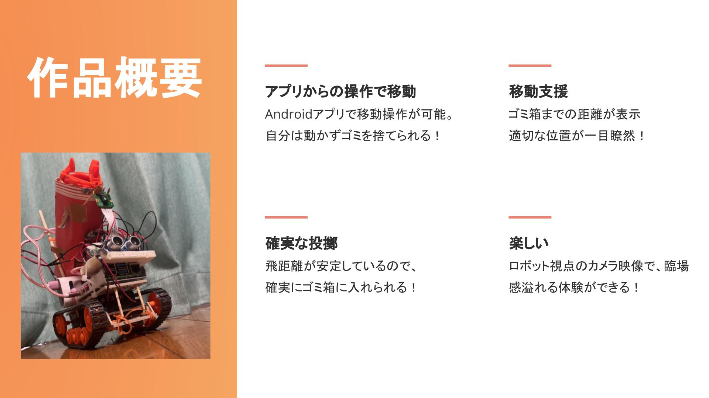
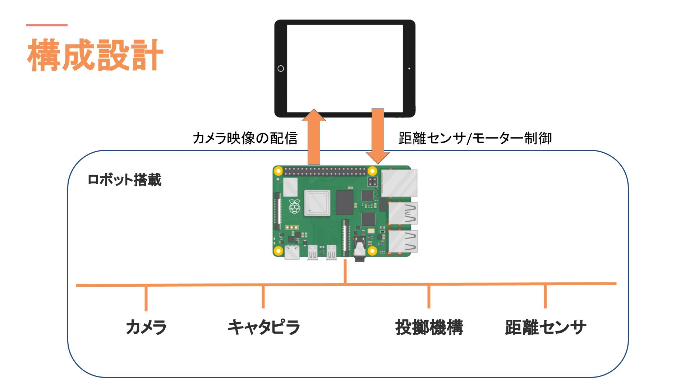
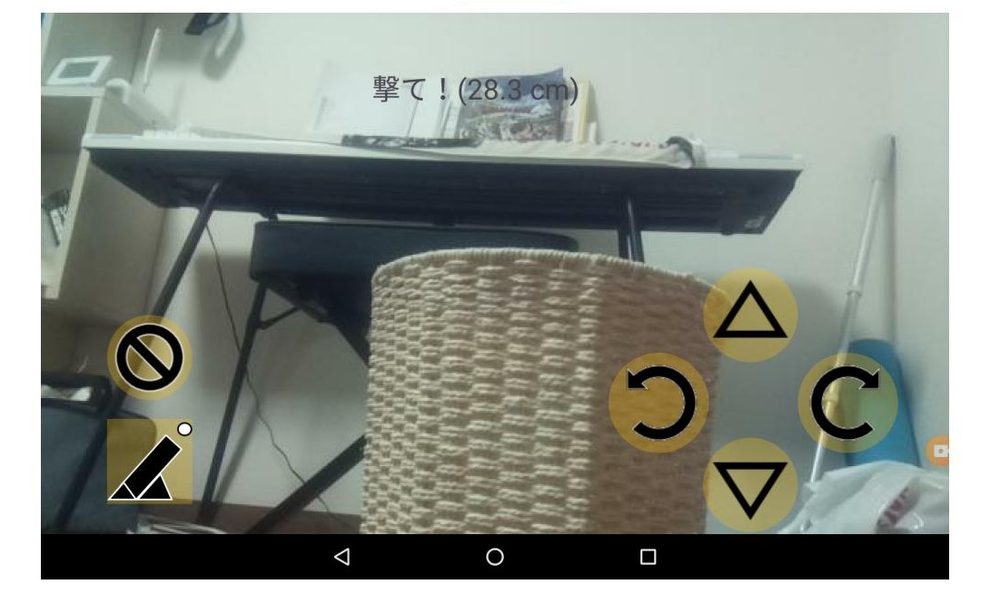

# TST_APP　ホッパー君
筑波大学大学院の講義「組み込みプログラム開発」による開発記録  
チーム名「TST」  

## ラズパイの実装
* ラズパイ上のGPIOピンの値を変化させることで、キャタピラ/投擲のモーターを制御する。モータードライバとして東芝製TA7291Pを使用。
* 超音波距離センサHC-SR04を用いて距離を測定する。  
* ラズパイカメラモジュール v2およびmjpeg-streamerを用いてカメラの映像をPHPサーバ上でWeb配信を行う。  
* おもちゃのトス機構を取り出してGPIOピンと接続することで制御をおこなった。[(Amazon)本格卓球 爆裂 スマッシュ](https://www.amazon.co.jp/%E6%9C%AC%E6%A0%BC%E5%8D%93%E7%90%83-%E7%88%86%E8%A3%82-%E3%82%B9%E3%83%9E%E3%83%83%E3%82%B7%E3%83%A5%E3%80%90%E6%97%A5%E6%9C%AC%E3%81%8A%E3%82%82%E3%81%A1%E3%82%83%E5%A4%A7%E8%B3%9E2019-%E3%82%B3%E3%83%9F%E3%83%A5%E3%83%8B%E3%82%B1%E3%83%BC%E3%82%B7%E3%83%A7%E3%83%B3%E3%83%BB%E3%83%88%E3%82%A4%E9%83%A8%E9%96%80-%E5%84%AA%E7%A7%80%E8%B3%9E%E3%80%91/dp/B07SX2MGK1 "本格卓球 爆裂 スマッシュ")
* 
  
## Androidアプリの実装

* android-mjpeg-view(https://github.com/perthcpe23/android-mjpeg-view)を使用してWeb配信されている映像を取得し背景として配置する。
* モーターや投擲機構を操作するボタンを配置。信号をHttp通信でサーバに送ることでモーターや距離センサを制御するプログラムを実行する。